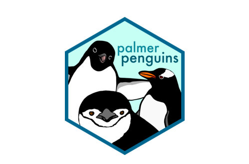

<!-- README.md is generated from README.Rmd. Please edit that file -->

```{r, include = FALSE}
knitr::opts_chunk$set(
  collapse = TRUE,
  comment = "#>",
  fig.path = "man/figures/README-",
  out.width = "100%"
)
```

# penguinsbox 

<!-- badges: start -->

<!-- badges: end -->


The goal of penguinsbox is to supplement the [R for Data Science book](https://r4ds.had.co.nz/) with fading exercises using the penguins and datasets. The package uses these datasets to cover materials of the R4DS and the learnr tutorials.

_El objetivo es tener un paquete espejo "pingüinoscaja" que  y que cubra los materiales del libro [R para ciencia de datos](https://es.r4ds.hadley.nz/) con ejercicios progresivos usando los datos pingüinos y el paquete learnr para crear tutoriales._

## Installation

<!--
You can install the released version of Penguinsbox from [CRAN](https://CRAN.R-project.org) with:

You can install the development version from [GitHub](https://github.com/) with:

-->

penguinsbox is not yet on CRAN. For now, you can install it from GitHub with:

```{r, eval=FALSE}
# install.packages("devtools")
devtools::install_github("demar01/penguinsbox")
```

## Questions, bugs, feature requests

You can file an issue to get help, report a bug, or make a feature request.

When filing an issue to get help or report a bug, please make a minimal **repr**oducible **ex**ample using the [reprex](https://reprex.tidyverse.org/) package. 
If you haven't heard of or used reprex before, you're in for a treat! 
Seriously, reprex will make all of your R-question-asking endeavors easier (which is a pretty insane ROI for the five to ten minutes it'll take you to learn what it's all about). 
For additional reprex pointers, check out the [Get help!](https://www.tidyverse.org/help/) section of the tidyverse site.

Before opening a new issue, be sure to [search issues and pull requests](https://github.com/rstudio-education/dsbox/issues) to make sure the bug hasn't been reported and/or already fixed in the development version. 
By default, the search will be pre-populated with `is:issue is:open`. 
You can [edit the qualifiers](https://help.github.com/articles/searching-issues-and-pull-requests/) (e.g. `is:pr`, `is:closed`) as needed. 
For example, you'd simply remove `is:open` to search _all_ issues in the repo, open or closed.

## Code of Conduct
  
Please note that the penguinsbox project is released with a [Contributor Code of Conduct](https://contributor-covenant.org/version/2/0/CODE_OF_CONDUCT.html). 
By contributing to this project, you agree to abide by its terms.
