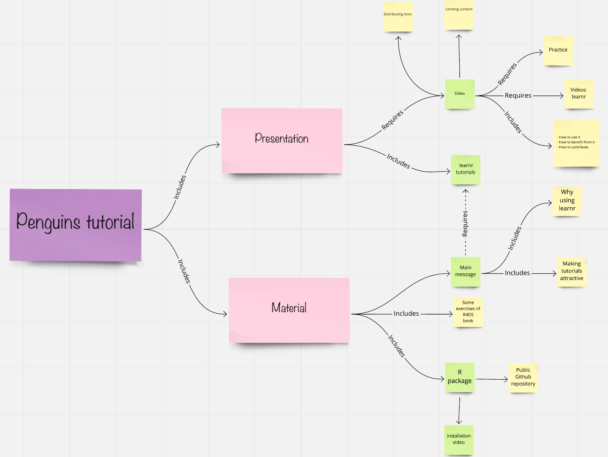

<!-- README.md is generated from README.Rmd. Please edit that file -->

```{r, include = FALSE}
knitr::opts_chunk$set(
  collapse = TRUE,
  comment = "#>",
  fig.path = "man/figures/README-",
  out.width = "100%"
)
```

# Pingüinos en caja en useR2021! 

<!-- badges: start -->

<!-- badges: end -->


Presentaremos este tutorial en [useR! 2021 online tutorial](https://user2021.r-project.org/program/tutorials/) el Miercoles 7 de Julio 2021 2:45-3:45 GMT. 


[Link](https://docs.google.com/presentation/d/1LXuVnfO_MPYdrmC9SNBizKg1nyBbP9J8bWNRLGLiX9I/edit) con las diapositivas de nuestra presentación.


## Objetivo

El objetivo del paquete `penguinsbox` (pingüinoscaja) es tener un recurso adicional que cubra los materiales del libro [R para ciencia de datos](https://es.r4ds.hadley.nz/) con ejercicios de desvanecido, preguntas de opcion múltiple y problemas de Parson usando los [datos de pingüinos](https://github.com/cienciadedatos/datos).
El paquete está construido con [learnr](https://github.com/rstudio/learnr) para crear tutoriales.


## Instalación

`penguinsbox` no está todavia en CRAN. Por ahora, puedes instalarlo desde GitHub con:

```{r, eval=FALSE}
# install.packages("devtools")
devtools::install_github("demar01/penguinsbox")
```

Esta instalación debería ser suficiente para ejecutar `penguinsbox`. Sin embargo, `penguinsbox` depende de paquetes en desarrollo como `gradethis` y `parsons`. En caso de que tengas algún problema con la instalación, intenta installar los paquetes individualmente con los siguientes links:

```{r, eval=FALSE}
remotes::install_github("rstudio/parsons")
remotes::install_github("rstudio/gradethis")
```

En caso de que no consigas instalar `penguinsbox` en tu computadora, por favor [describenos tu problema.](https://github.com/rstudio-education/dsbox/issues)


## ¿Cómo ejecutar cada tutorial?

Una vez que te hayas instalado el paquete `penguinsbox`, puedes correr cada tutorial por separado, especificando el nombre del tutorial.

```{r, eval=FALSE}
learnr::run_tutorial("Tutorial-escojido", package = "penguinsbox")
```

Por ejemplo, para correr el primer ejercicio prueba:

```{r, eval=FALSE}
learnr::run_tutorial("00-learnr-ES", package = "penguinsbox")
```

Puedes ver todos los tutoriales displonibles en `penguinsbox` con:

```{r, eval=FALSE}
learnr::available_tutorials("penguinsbox")
```

Si estas trabajando en una computadora de Windows, es posible que al producir los ejercicios con learner algunos signos de español (e.g.la ñ) no se generen correctamente. Esto no pasa en shinny app. 

Por eso te damos algunos links para que accedas a traves de Shiny app. Para los ejercicios de iteración puedes accedes [aqui](https://mariadermituser1.shinyapps.io/05-Iteration-es/#) y para los ejercicios de ggplot2 puedes acceder [aqui](https://mariadermituser1.shinyapps.io/03-ggplot2-es/)


## ¿Para quién es este tutorial?

Este paquete tutorial esta dirigido a dos Personas tipo: Educadora y Estudiante.

**Persona educadora**

Si eres un educador y estás enseñando nivel intermedio de ciencia de datos con el libro [R para ciencia de datos](https://es.r4ds.hadley.nz/) y:

-   quieres usar ejercicios interactivos y en español para tus clases.
-   quieres aprender cómo hacer estos ejercicios interactivos con [learnr](https://github.com/rstudio/learnr)
-   quieres usar ejercicios interactivos addicionales a [Primers de Rstudio](https://rstudio.cloud/learn/primers).

**Persona estudiante**

Si tienes un nivel intermedio de R y estás aprendiendo ciencia de datos a con el libro [R para ciencia de datos](https://es.r4ds.hadley.nz/) y:

-   quieres aprender los beneficios de usar estos ejercicios para aprender ciencia de datos
-   quieres usar ejercicios interactivos y en español parecidos a [Primers de Rstudio](https://rstudio.cloud/learn/primers).


## Porqué hicimos penguinsbox así


¿Por qué pinguinos?  
- El conjunto de datos está disponible en el paquete datos
- Tienen valores faltantes  
- Hay un arte adorable (gracias a Hallison Host)  
- Hubo un Tidytuesday con estos datos  (2020-07-28)  
- Están disponibles en español en el paquete datos (pinguinos) y en portugués en el paquete dados (pinguins). Este tutorial podría traducirse fácilmente al portugués (y con suerte a otros idiomas)

¿Por qué learnr?  
- Learnr es simplemente un fichero Rmarkdown y es fácil de desarrollar
- Se puede hacer evaluación formativa a lo largo del tutorial
- Extensa documentación sobre como desarrollar learnr.

¿Por qué Rstudio/shiny?

- Permite el estudio asincrónico
- Complementa recursos disponibles para estudiar CD.


## Mapa conceptual de nuestro tutorial


## ¿Cómo hacer ejercicios de learnr?

Puedes ver el el código fuente de el tutorial piloto [00-learnr](https://github.com/demar01/penguinsbox/blob/master/inst/tutorials/00-learnr-ES/00-Learnr-ES.Rmd) para ver cómo hicimos los tres tipos de ejercicios.
Además, te recomendamos que veas el video Construyendo tutoriales con learn de rstudio::conf 2020 para ver los criterios a tener en cuenta al desarroyar un tutorial learnr.
También te recomendamos los otros links en español para aprender a construir tutoriales de learnr:

`r emo::ji("video")` [Construyendo tutoriales con learnr](https://www.youtube.com/watch?v=EBAvQkP9Kycw)

`r emo::ji("folder")` [Aprendiendo learnr](https://learning-learnr.netlify.app/)

`r emo::ji("link")` [Taller de learnr](https://github.com/yabellini/curso_learnr)


## Preguntas, errores, solicitudes de funciones

Puedes abrir un problema para obtener ayuda, informar un error o solicitar una función.

Cuando presentes un problema para obtener ayuda o informar un error, haz un mínimo ejemplo reproducible usando el paquete [reprex](https://reprex.tidyverse.org/).

Si no has oído hablar de reprex o no lo ha usado antes, ¡te espera una sorpresa!
En serio, reprex facilitará todos tus esfuerzos para hacer preguntas R (que es muy buen retorno de inversión para los cinco a diez minutos que le llevará aprender de qué se trata).
Para obtener sugerencias adicionales sobre reprex, consulta la sección [¡Obtenga ayuda!-Get help!](https://www.tidyverse.org/help/)
del sitio tidyverse.

Antes de abrir un nuevo problema, comprueba [issues and pull requests](https://github.com/rstudio-education/dsbox/issues) para asegurarte de que el error no se haya informado y/o ya se haya solucionado en la versión de desarrollo.

## Código de Conducta

Por favor, ten en cuenta que el proyecto penguins caja sigue un [Código de Conducta.](https://www.contributor-covenant.org/es/version/2/0/code_of_conduct/)
Al contribuir a este proyecto, acepta cumplir sus términos.

## Licencia

Todo el material de `penguinsbox` tiene licencia Creative Commons Attribution Share Alike 4.0 International.

# Penguins in a box in useR2021! 


<!-- badges: end -->


We will present this [useR! 2021 online tutorial](https://user2021.r-project.org/program/tutorials/) on Wednesday July 7th 2021 at 7:15-8:15 GMT. 

You can find the slides for our presentation  [here](https://docs.google.com/presentation/d/1e5_ZvsR0cxfJxYhXsRQoseuiIO8NAiyEodWoxwoB6gg/edit).

## Goal 
The goal of `penguinsbox` package is to supplement the [R for Data Science book](https://r4ds.had.co.nz/) with fading exercises, multiple choice questions and Parsons problems using the palmerpenguins and datasets. The package is built using [learnr](https://github.com/rstudio/learnr) tutorials.

## Instalation

`penguinsbox` is not yet on CRAN. For now, you can install it from GitHub with:

```{r, eval=FALSE}
# install.packages("devtools")
devtools::install_github("demar01/penguinsbox")
```

This installation should be enough to run `penguinsbox`. However, `penguinsbox` depends on packages on development state such as `gradethis` and `parsons`. In case you have any problems with the installation, try to install those packages individually with the following links:

```{r, eval=FALSE}
remotes::install_github("rstudio/parsons")
remotes::install_github("rstudio/gradethis")
```

In case you cannot install `penguinsbox` on your computer, [please describe  your problem in the issues page.](https://github.com/rstudio-education/dsbox/issues) 

## How to run each individual tutorial?

Once you got the package installed, you can run each individual tutorial by typing the name of the tutorial.

```{r, eval=FALSE}
learnr::run_tutorial("tutorial-of-choice", package = "learntidymodels")
```

For example, to run the first exercise try:

```{r, eval=FALSE}
learnr::run_tutorial("00-learnr", package = "penguinsbox")
```

You can check the available tutorials on `penguinsbox` by running:

```{r, eval=FALSE}
learnr::available_tutorials("penguinsbox")
```

You can access some of our tutorials through Shiny. You can find get access to the [iteration tutorial](https://mariadermituser1.shinyapps.io/05-Iteration/) and the [ggplot tutorial](https://mariadermituser1.shinyapps.io/03-ggplot2/).


## Who is this tutorial for?

This tutorial package is aimed for two Personas types: Educator and Students.

**Educator persona**

If you are an educator and you are teaching data science with the [R for Data Science book](https://r4ds.had.co.nz/) and:

-   you want to use additional interactive exercises similar to [Primers de Rstudio](https://rstudio.cloud/learn/primers) and [Data science box](https://datasciencebox.org/interactive-tutorials.html)
-   you want to learn how to build [learnr](https://github.com/rstudio/learnr) tutorials

**Student persona** If you have an intermediate level of R and you are learning data science using R and:

-   you want to learn the benefits of using interactive exercises to learn data science effectively
-   you want to practice with additional interactive exercises


## Penguinsbox structure rational


Why penguins?

- Penguins is a nice dataset alternative to iris
- The dataset is available in the palmerpenguins package  
- The have missing values
- There is cute art ( thanks to Hallison Host)
- There was a Tidytuesday content (2020-07-28)
- They are included in datos package in Spanish (pinguinos) and in dados package in Portuguese (pinguins); tutorial could be easily translated to Portuguese.

Why learnr?

- Learnr is simply a Rmarkdown file and is easy to develop
- Se puede hacer evaluación formativa a lo largo del tutorial
- Extensa documentación sobre como desarrollar learnr.

Why Rstudio/shiny?

- It allows asynchronous teaching/learning
- Complements other available data science study resources.


## Concept map of our lesson



## How to do learnr exercises?

You can check the source code of the pilot [00-learnr](https://github.com/demar01/penguinsbox/blob/master/inst/tutorials/00-learnr/00-Learnr.Rmd) so you can see how we did the first types of exercises. Besides that, you can check the linksbelow with interesting information about building and sharing learnr tutorials:

`r emo::ji("document")`[Learning learnr](https://education.rstudio.com/blog/2020/07/learning-learnr/)

`r emo::ji("document")` [Learnr for remote](https://education.rstudio.com/blog/2020/05/learnr-for-remote/?utm_content=buffer94d2c&utm_medium=social&utm_source=facebook&utm_campaign=buffer)

`r emo::ji("document")` [Interactive tutorials with learnr](https://desiree.rbind.io/post/2020/learnr-iframes/)

`r emo::ji("link")` [Learnr repo](https://rstudio.github.io/learnr/)

`r emo::ji("video")` [Friendly learnr tutorials](https://www.rstudio.com/resources/rstudioconf-2020/of-teacups-giraffes-r-markdown/)

`r emo::ji("video")` [Feedback for learnr tutorials](https://www.rstudio.com/resources/rstudioconf-2018/adaptive-feedback-for-learnr-tutorials-daniel-kaplan/)


## Questions, bugs, feature requests

You can file an issue to get help, report a bug, or make a feature request:

When filing an issue to get help or report a bug, please make a minimal **repr**oducible **ex**ample using the [reprex](https://reprex.tidyverse.org/) package. If you haven't heard of or used reprex before, you're in for a treat! Seriously, reprex will make all of your R-question-asking endeavors easier (which is a pretty insane ROI for the five to ten minutes it'll take you to learn what it's all about). For additional reprex pointers, check out the [Get help!](https://www.tidyverse.org/help/) section of the tidyverse site.

Before opening a new issue, be sure to [search issues and pull requests](https://github.com/rstudio-education/dsbox/issues) to make sure the bug hasn't been reported and/or already fixed in the development version. By default, the search will be pre-populated with `is:issue is:open`. You can [edit the qualifiers](https://help.github.com/articles/searching-issues-and-pull-requests/) (e.g. `is:pr`, `is:closed`) as needed. For example, you'd simply remove `is:open` to search all issues in the repo, open or closed.

## Code of Conduct

Please note that the penguinsbox project is released with a [Contributor Code of Conduct](https://contributor-covenant.org/version/2/0/CODE_OF_CONDUCT.html). By contributing to this project, you agree to abide by its terms.

## License

Note that all materials are released with [Creative Commons Attribution Share Alike 4.0 International](LICENSE.md) license.

