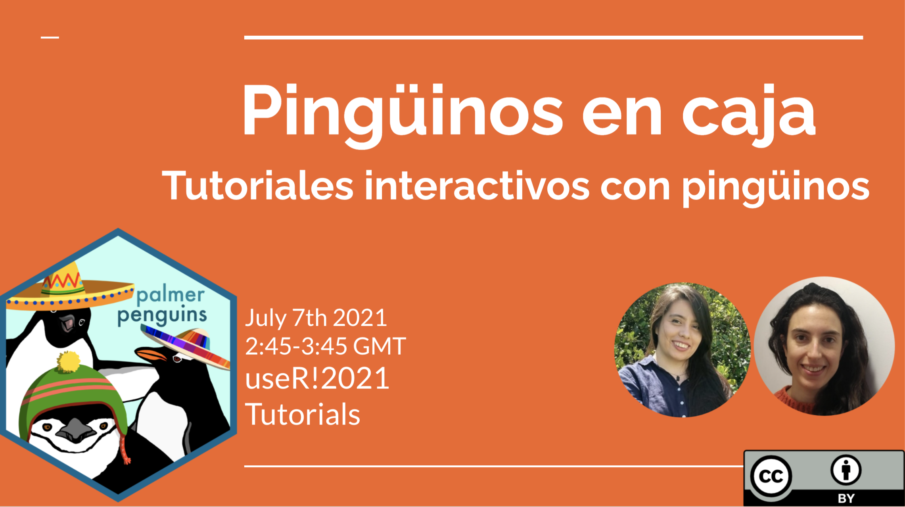
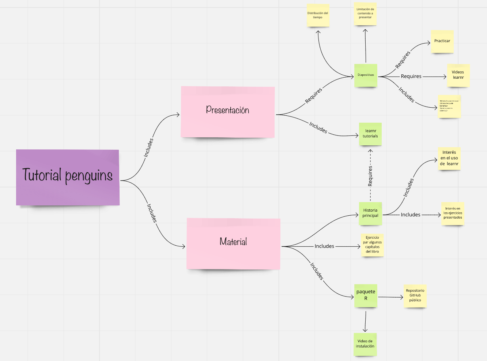
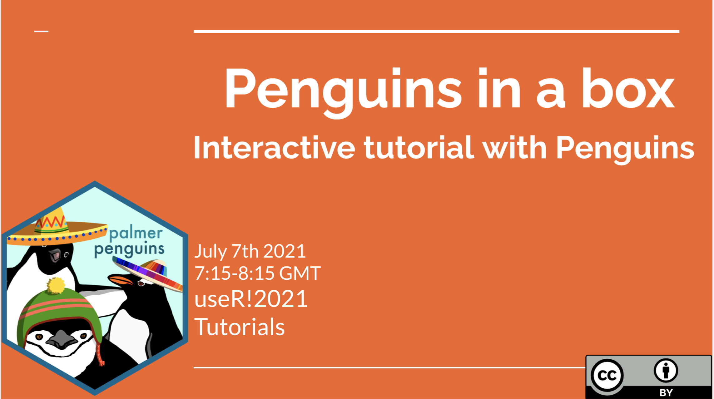
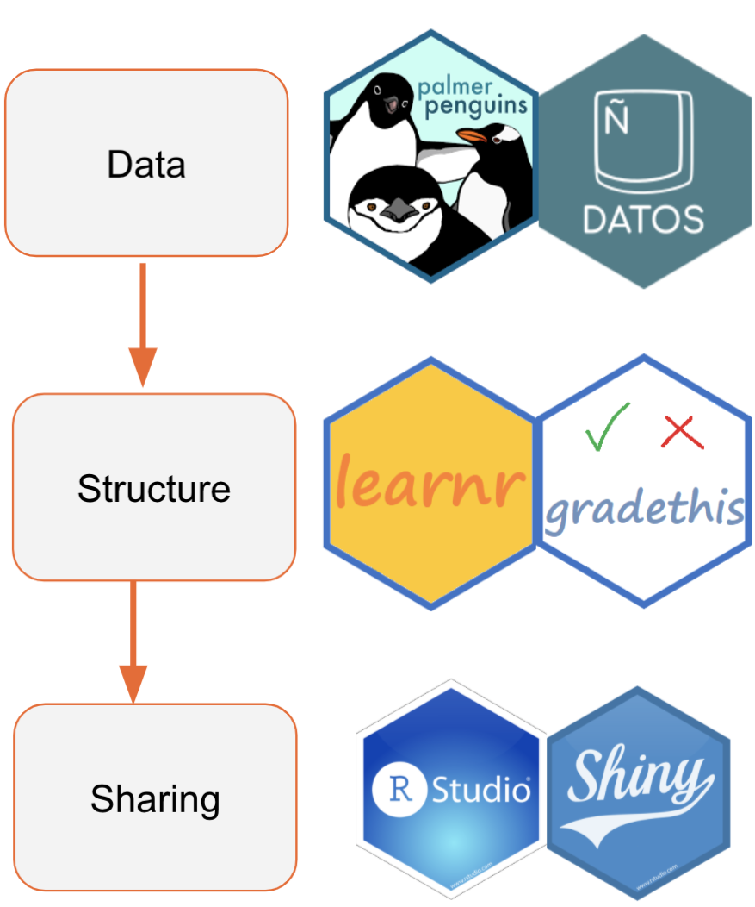

<!-- README.md is generated from README.Rmd. Please edit that file -->

# Pingüinos en caja en useR2021!

<!-- badges: start -->


<!-- badges: end -->



Presentaremos este tutorial en [useR! 2021 online
tutorial](https://user2021.r-project.org/program/tutorials/) el
Miercoles 7 de Julio 2021 2:45-3:45 GMT.

[Link](https://docs.google.com/presentation/d/1LXuVnfO_MPYdrmC9SNBizKg1nyBbP9J8bWNRLGLiX9I/edit)
con las diapositivas de nuestra presentación.

## Objetivo

El objetivo del paquete `penguinsbox` (pingüinoscaja) es tener un
recurso adicional que cubra los materiales del libro [R para ciencia de
datos](https://es.r4ds.hadley.nz/) con ejercicios de desvanecido,
preguntas de opcion múltiple y problemas de Parson usando los [datos de
pingüinos](https://github.com/cienciadedatos/datos). El paquete está
construido con [learnr](https://github.com/rstudio/learnr) para crear
tutoriales.

## Instalación

`penguinsbox` no está todavia en CRAN. Por ahora, puedes instalarlo
desde GitHub con:

``` r
# install.packages("devtools")
devtools::install_github("demar01/penguinsbox")
```

Esta instalación debería ser suficiente para ejecutar `penguinsbox`. Sin
embargo, `penguinsbox` depende de paquetes en desarrollo como
`gradethis` y `parsons`. En caso de que tengas algún problema con la
instalación, intenta installar los paquetes individualmente con los
siguientes links:

``` r
remotes::install_github("rstudio/parsons")
remotes::install_github("rstudio/gradethis")
```

En caso de que no consigas instalar `penguinsbox` en tu computadora, por
favor [describenos tu
problema.](https://github.com/rstudio-education/dsbox/issues)

## ¿Cómo ejecutar cada tutorial?

Una vez que te hayas instalado el paquete `penguinsbox`, puedes correr
cada tutorial por separado, especificando el nombre del tutorial.

``` r
learnr::run_tutorial("Tutorial-escojido", package = "penguinsbox")
```

Por ejemplo, para correr el primer ejercicio prueba:

``` r
learnr::run_tutorial("00-learnr-ES", package = "penguinsbox")
```

Puedes ver todos los tutoriales displonibles en `penguinsbox` con:

``` r
learnr::available_tutorials("penguinsbox")
```

Si estas trabajando en una computadora de Windows, es posible que al
producir los ejercicios con learner algunos signos de español (e.g.ñ) no
se generen correctamente. Esto no pasa en shinny app.

Por eso te damos algunos links para que accedas a traves de Shiny app.
Para los ejercicios de iteración puedes accedes
[aqui](https://mariadermituser1.shinyapps.io/05-Iteration-es/#) y para
los ejercicios de ggplot2 puedes acceder
[aqui](https://mariadermituser1.shinyapps.io/03-ggplot2-es/)

## ¿Para quién es este tutorial?

Este paquete tutorial esta dirigido a dos Personas tipo: Educadora y
Estudiante.

**Persona educadora**

Si eres un educador y estás enseñando nivel intermedio de ciencia de
datos con el libro [R para ciencia de datos](https://es.r4ds.hadley.nz/)
y:

-   quieres usar ejercicios interactivos y en español para tus clases.
-   quieres aprender cómo hacer estos ejercicios interactivos con
    [learnr](https://github.com/rstudio/learnr)
-   quieres usar ejercicios interactivos addicionales a [Primers de
    Rstudio](https://rstudio.cloud/learn/primers).

**Persona estudiante**

Si tienes un nivel intermedio de R y estás aprendiendo ciencia de datos
a con el libro [R para ciencia de datos](https://es.r4ds.hadley.nz/) y:

-   quieres aprender los beneficios de usar estos ejercicios para
    aprender ciencia de datos
-   quieres usar ejercicios interactivos y en español parecidos a
    [Primers de Rstudio](https://rstudio.cloud/learn/primers).

## Porqué hicimos penguinsbox así


¿Por qué pinguinos?  
- El conjunto de datos está disponible en el paquete datos - Tienen
valores faltantes  
- Hay un arte adorable (gracias a Hallison Host)  
- Hubo un Tidytuesday con estos datos (2020-07-28)  
- Están disponibles en español en el paquete datos (pinguinos) y en
portugués en el paquete dados (pinguins). Este tutorial podría
traducirse fácilmente al portugués (y con suerte a otros idiomas)

¿Por qué learnr?  
- Learnr es simplemente un fichero Rmarkdown y es fácil de desarrollar -
Se puede hacer evaluación formativa a lo largo del tutorial - Extensa
documentación sobre como desarrollar learnr.

¿Por qué Rstudio/shiny?

-   Permite el estudio asincrónico
-   Complementa recursos disponibles para estudiar CD.

## Mapa conceptual de nuestro tutorial



## ¿Cómo hacer ejercicios de learnr?

Puedes ver el el código fuente de el tutorial piloto
[00-learnr](https://github.com/demar01/penguinsbox/blob/master/inst/tutorials/00-learnr-ES/00-Learnr-ES.Rmd)
para ver cómo hicimos los tres tipos de ejercicios. Además, te
recomendamos que veas el video Construyendo tutoriales con learn de
rstudio::conf 2020 para ver los criterios a tener en cuenta al
desarroyar un tutorial learnr. También te recomendamos los otros links
en español para aprender a construir tutoriales de learnr:

📺 [Construyendo tutoriales con
learnr](https://www.youtube.com/watch?v=EBAvQkP9Kycw)

📁 [Aprendiendo learnr](https://learning-learnr.netlify.app/)

🔗 [Taller de learnr](https://github.com/yabellini/curso_learnr)


Aqui te mostramos como puedes hacer tutoriales learnr a traves de la plantilla de learnr.

https://user-images.githubusercontent.com/5008157/122995604-b6807780-d3a1-11eb-8641-b96c97bbf967.mp4


## Preguntas, errores, solicitudes de funciones

Puedes abrir un problema para obtener ayuda, informar un error o
solicitar una función.

Cuando presentes un problema para obtener ayuda o informar un error, haz
un mínimo ejemplo reproducible usando el paquete
[reprex](https://reprex.tidyverse.org/).

Si no has oído hablar de reprex o no lo ha usado antes, ¡te espera una
sorpresa! En serio, reprex facilitará todos tus esfuerzos para hacer
preguntas R (que es muy buen retorno de inversión para los cinco a diez
minutos que le llevará aprender de qué se trata). Para obtener
sugerencias adicionales sobre reprex, consulta la sección [¡Obtenga
ayuda!-Get help!](https://www.tidyverse.org/help/) del sitio tidyverse.

Antes de abrir un nuevo problema, comprueba [issues and pull
requests](https://github.com/rstudio-education/dsbox/issues) para
asegurarte de que el error no se haya informado y/o ya se haya
solucionado en la versión de desarrollo.

## Código de Conducta

Por favor, ten en cuenta que el proyecto penguins caja sigue un [Código
de
Conducta.](https://www.contributor-covenant.org/es/version/2/0/code_of_conduct/)
Al contribuir a este proyecto, acepta cumplir sus términos.

## Licencia

Todo el material de `penguinsbox` tiene licencia Creative Commons
Attribution Share Alike 4.0 International.

# Penguins in a box in useR2021!

\ 
<!-- badges: end -->



We will present this [useR! 2021 online
tutorial](https://user2021.r-project.org/program/tutorials/) on
Wednesday July 7th 2021 at 7:15-8:15 GMT.

## Goal

The goal of `penguinsbox` package is to supplement the [R for Data
Science book](https://r4ds.had.co.nz/) with fading exercises, multiple
choice questions and Parsons problems using the palmerpenguins and
datasets. The package is built using
[learnr](https://github.com/rstudio/learnr) tutorials.

## Instalation

`penguinsbox` is not yet on CRAN. For now, you can install it from
GitHub with:

``` r
# install.packages("devtools")
devtools::install_github("demar01/penguinsbox")
```

This installation should be enough to run `penguinsbox`. However,
`penguinsbox` depends on packages on development state such as
`gradethis` and `parsons`. In case you have any problems with the
installation, try to install those packages individually with the
following links:

``` r
remotes::install_github("rstudio/parsons")
remotes::install_github("rstudio/gradethis")
```

In case you cannot install `penguinsbox` on your computer, [please
describe your problem in the issues
page.](https://github.com/rstudio-education/dsbox/issues)

## How to run each individual tutorial?

Once you got the package installed, you can run each individual tutorial
by typing the name of the tutorial.

``` r
learnr::run_tutorial("tutorial-of-choice", package = "learntidymodels")
```

For example, to run the first exercise try:

``` r
learnr::run_tutorial("00-learnr", package = "penguinsbox")
```

You can check the available tutorials on `penguinsbox` by running:

``` r
learnr::available_tutorials("penguinsbox")
```

## Who is this tutorial for?

This tutorial package is aimed for two Personas types: Educator and
Students.

**Educator persona**

If you are an educator and you are teaching data science with the [R for
Data Science book](https://r4ds.had.co.nz/) and:

-   you want to use additional interactive exercises similar to [Primers
    de Rstudio](https://rstudio.cloud/learn/primers) and [Data science
    box](https://datasciencebox.org/interactive-tutorials.html)
-   you want to learn how to build
    [learnr](https://github.com/rstudio/learnr) tutorials

**Student persona** If you have an intermediate level of R and you are
learning data science using R and:

-   you want to learn the benefits of using interactive exercises to
    learn data science effectively
-   you want to practice with additional interactive exercises

## Penguinsbox structure rational



Why penguins?

-   Penguins is a nice dataset alternative to iris
-   The dataset is available in the palmerpenguins package  
-   The have missing values
-   There is cute art ( thanks to Hallison Host)
-   There was a Tidytuesday content (2020-07-28)
-   They are included in datos package in Spanish (pinguinos) and in
    dados package in Portuguese (pinguins); tutorial could be easily
    translated to Portuguese.

Why learnr?

-   Learnr is simply a Rmarkdown file and is easy to develop
-   Se puede hacer evaluación formativa a lo largo del tutorial
-   Extensa documentación sobre como desarrollar learnr.

Why Rstudio/shiny?

-   It allows asynchronous teaching/learning
-   Complements other available data science study resources.

## Concept map of our lesson


## How to do learnr exercises?

You can check the source code of the pilot
[00-learnr](https://github.com/demar01/penguinsbox/blob/master/inst/tutorials/00-learnr/00-Learnr.Rmd)
so you can see how we did the first types of exercises. Besides that,
you can check the linksbelow with interesting information about building
and sharing learnr tutorials:

📃[Learning
learnr](https://education.rstudio.com/blog/2020/07/learning-learnr/)

📜 [Learnr for
remote](https://education.rstudio.com/blog/2020/05/learnr-for-remote/?utm_content=buffer94d2c&utm_medium=social&utm_source=facebook&utm_campaign=buffer)

📜 [Interactive tutorials with
learnr](https://desiree.rbind.io/post/2020/learnr-iframes/)

🔗 [Learnr repo](https://rstudio.github.io/learnr/)

📽 [Friendly learnr
tutorials](https://www.rstudio.com/resources/rstudioconf-2020/of-teacups-giraffes-r-markdown/)

📸 [Feedback for learnr
tutorials](https://www.rstudio.com/resources/rstudioconf-2018/adaptive-feedback-for-learnr-tutorials-daniel-kaplan/)

## Questions, bugs, feature requests

You can file an issue to get help, report a bug, or make a feature
request:

When filing an issue to get help or report a bug, please make a minimal
**repr**oducible **ex**ample using the
[reprex](https://reprex.tidyverse.org/) package. If you haven’t heard of
or used reprex before, you’re in for a treat! Seriously, reprex will
make all of your R-question-asking endeavors easier (which is a pretty
insane ROI for the five to ten minutes it’ll take you to learn what it’s
all about). For additional reprex pointers, check out the [Get
help!](https://www.tidyverse.org/help/) section of the tidyverse site.

Before opening a new issue, be sure to [search issues and pull
requests](https://github.com/rstudio-education/dsbox/issues) to make
sure the bug hasn’t been reported and/or already fixed in the
development version. By default, the search will be pre-populated with
`is:issue is:open`. You can [edit the
qualifiers](https://help.github.com/articles/searching-issues-and-pull-requests/)
(e.g. `is:pr`, `is:closed`) as needed. For example, you’d simply remove
`is:open` to search all issues in the repo, open or closed.

## Code of Conduct

Please note that the penguinsbox project is released with a [Contributor
Code of
Conduct](https://contributor-covenant.org/version/2/0/CODE_OF_CONDUCT.html).
By contributing to this project, you agree to abide by its terms.

## License

Note that all materials are released with [Creative Commons Attribution
Share Alike 4.0 International](LICENSE.md) license.
